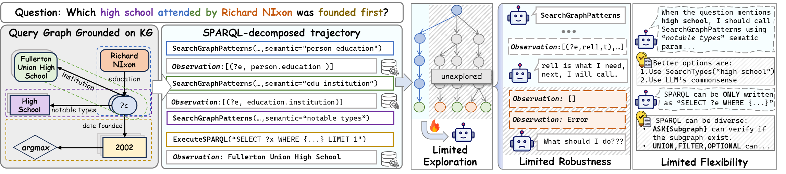
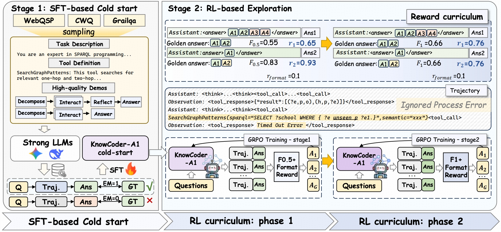
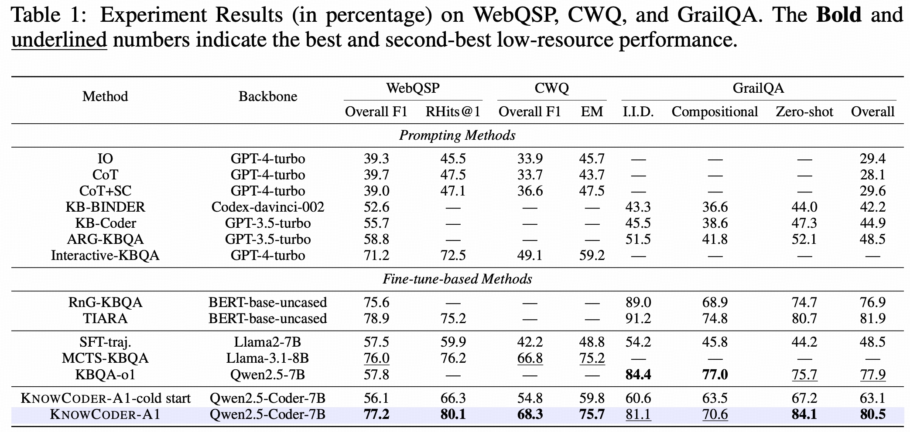

# KnowCoder-A1: Incentivizing Agentic Reasoning Capability with Outcome Supervision for KBQA

[paper](https://arxiv.org/pdf/2510.25101) ｜ [homepage]()

---

## Overview

<div align="center">
  
</div>

Knowledge Base Question Answering (KBQA) leverages the rich structure and semantics of large-scale knowledge bases (KBs) to answer natural language questions, and is crucial for applications such as search engines, medical assistants, and financial risk analysis. While existing KBQA systems handle simple questions reasonably well, they still struggle with complex, real-world questions that require long-horizon reasoning and adaptation to heterogeneous KB schemas.

Recent *agentic* KBQA methods let large language models (LLMs) plan, call tools, and interact with KBs, but they typically depend on **process supervision**: they learn from ideal, hand-crafted (or synthesized) reasoning traces derived from gold logical forms. This makes them brittle to noisy tool interactions and limits their flexibility to explore alternative reasoning strategies.

<div align="center">
  
</div>

In this work, we propose **KnowCoder-A1**, an LLM-based KBQA agent that learns to reason over KBs primarily from **outcome supervision**. Instead of imitating a single “perfect” trajectory, our model is trained to autonomously decompose tasks, invoke tools, refine formal queries (e.g., SPARQL), and execute them to obtain correct answers.

We first bootstrap a small set of high-quality agentic trajectories via outcome-based rejection sampling to establish basic KB reasoning skills. Then, we introduce a **multi-stage curriculum reinforcement learning** framework with progressively more challenging reward criteria, which mitigates reward sparsity, discourages reward hacking, and steadily strengthens autonomous exploration and complex reasoning.

With only ~6.7k outcome-supervised examples, KnowCoder-A1 achieves strong state-of-the-art performance on WebQSP, CWQ, and GrailQA, including **80.5 F1 on GrailQA** using **12× less training data** than prior methods, and up to **11.1% relative improvement** in zero-shot settings—demonstrating robustness to noisy interactions and strong generalization to unseen complex questions.

---

## Experimental Results

<div align="center">
  
</div>

---

## KnowCoder-A1 Implementation

### Environment Setup

```bash
pip3 install -r requirements.txt
```

We use **verl** as the reinforcement learning framework. It is included as a git submodule:

```bash
# Initialize and update git submodules
git submodule update --init --recursive

# Install verl in editable mode
cd verl
pip3 install -e .
cd ..

# Install specific versions of vLLM and FlashAttention
pip3 install vllm==0.8.4
pip3 install flash-attn==2.7.3 --no-build-isolation
```

### DB and Tool Setup

We provide a comprehensive, beginner-friendly tutorial that explains how to build the tools from raw DB files. All tools are encapsulated to support asynchronous invocation via HTTP APIs.

For a detailed setup guide, please refer to [Database and Tool Setup](./AgentKBQA/README.md).

---

## Cold-Start Stage

### Data Preparation

We conduct SFT training based on LlamaFactory on three datasets: WebQSP, CWQ, and GrailQA. The data used for SFT is already placed in `./data`.

### Implementation

We conduct SFT training based on [LlamaFactory](https://github.com/hiyouga/LLaMA-Factory).

---

## RL Stage

### Data Preparation

We conduct experiments on three datasets: WebQSP, CWQ, and GrailQA, which are already placed in `./Agent-KBR1/data/kbqa`.

#### Data Format

During training, both training and validation data are stored in **Parquet** format with the following fields. You can prepare and add additional data for training or evaluation as long as it follows this format.

```yaml
- `level` (string): The task level or identifier (e.g., "cwq", "grailqa").
- `data_source` (string): The name of the source dataset (e.g., "cwq", "grailqa").
- `prompt` (list): A list containing the conversation history or prompts.
    - `content` (string): The complete prompt content, including system instructions, formatting requirements, and the actual question.
    - `role` (string): The role of the message (e.g., "user").
- `ability` (string): A classification of the ability required for the task (e.g., "kbqa/stage1/cwq").
- `reward_model` (dict): Contains information for training the reward model.
    - `ground_truth` (list): A list of the ground truth answers to the question.
    - `style` (string): The type or evaluation rule for the reward model (e.g., "rule").
- `extra_info` (dict): Contains additional metadata.
    - `answer` (list): A list of the standard answers (usually identical to `ground_truth`).
    - `index` (int): The index of the data entry in the original dataset.
    - `question` (string): The original question text extracted from the prompt.
    - `source` (string): The data source (usually identical to `data_source`).
    - `sparql_query` (string): The corresponding ground truth SPARQL query for the question (if available).
    - `split` (string): The dataset split (e.g., "train", "validation").
    - `topic_entities` (string): A serialized string (usually a dictionary) containing the topic entities from the question and their IDs in the knowledge base.
```

### Training

#### Configuration

Training is managed by **Hydra** configs. The main config file is located at:

```text
agent_r1/src/config/agent_trainer.yaml
```

You can:

* Override configs via command-line arguments, or
* Create custom scripts (see `examples/trainer/`).

#### Start Backend Services

Before launching training, start the KB backend and API server.

1. Start Virtuoso Server

```bash
cd ./AgentKBQA  
export VIRTUOSO_HOME=/path/to/virtuoso-opensource
export PATH=.:${VIRTUOSO_HOME}/bin:$PATH

virtuoso-t -df -c tool_prepare/virtuoso_for_indexing.ini
```

2. Start API DB Server

In another terminal:

```bash
cd ./AgentKBQA
python api/api_db_server.py --db fb --port 9901
```

#### Launch Training

We provide example training scripts in `examples/trainer/`. For example, the first and second stages in our paper can be run with:

```bash
cd Agent-KBR1
bash examples/trainer/kbqa_f0.5_stage_1_2.sh
bash examples/trainer/kbqa_f1_stage_3.sh
```

Note: You may need to adjust these scripts according to your base model, data paths, and hardware.

---

## Evaluation

### Run Evaluation

We provide a unified script `eval/eval_all.py` for evaluation on multiple datasets:

```bash
python eval/eval_all.py \
    --dataset_name webqsp \
    --model_name agent \
    --max_turn 12 \
    --rollout_num 1 \
    --save_file test_results \
    --num_processes 10 \
    --mode test \
    --temperature 1.0 \
    --top_p 0.9
```

Supported datasets include:

* `webqsp`
* `cwq`
* `grailqa`

### Main Arguments

* `--dataset_name`: dataset name
* `--model_name`: identifier of the model variant
* `--max_turn`: maximum number of tool-calling turns
* `--rollout_num`: number of rollouts per example
* `--save_file`: prefix for the result file
* `--num_processes`: number of parallel processes
* `--mode`: `test` (test set) or `train` (train set)
* `--temperature`, `--top_p`: sampling parameters

---

## BibTex

If you find this work helpful for your research, please cite:

```bibtex
@article{chen2025knowcoder,
  title={KnowCoder-A1: Incentivizing Agentic Reasoning Capability with Outcome Supervision for KBQA},
  author={Chen, Zhuo and Wang, Fei and Li, Zixuan and Zhang, Zhao and Ding, Weiwei and Yang, Chuanguang and Xu, Yongjun and Jin, Xiaolong and Guo, Jiafeng},
  journal={arXiv preprint arXiv:2510.25101},
  year={2025}
}
```

---

## Acknowledgement

This repository benefits from the excellent work of the following projects:

* **[Agent-R1](https://github.com/0russwest0/Agent-R1)**
* **[verl](https://github.com/volcengine/verl)**
* **[LlamaFactory](https://github.com/hiyouga/LLaMA-Factory)**

We sincerely thank the authors and contributors of these frameworks for making their work available.

---

## Contact

For further questions, please contact: **[chenzhuo23s@ict.ac.cn](mailto:chenzhuo23s@ict.ac.cn)**.
